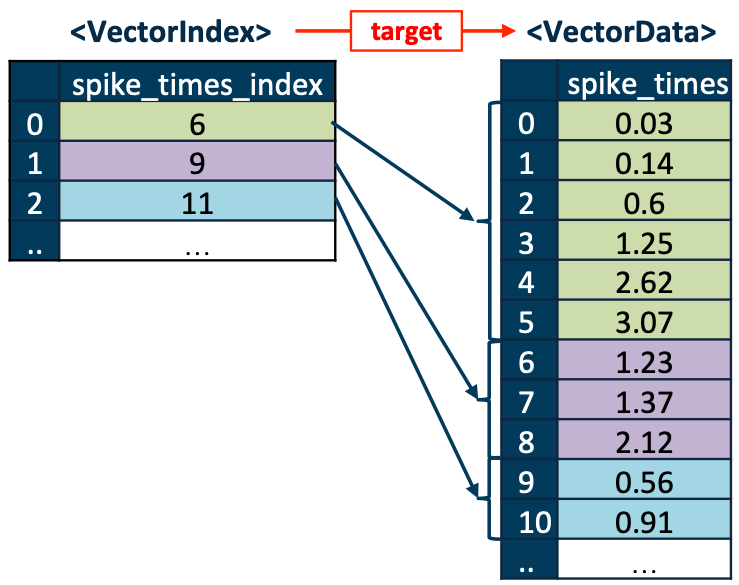

Overview of hdmf-common
=======================

hdmf-common defines common data structures to be used across applications.

.. sec-DynamicTable:

``DynamicTable``
----------------

The `DynamicTable <sec-DynamicTable>`_ type is used to store tabular data. The tables are created in a columnar fashion
with each column stored in its own `VectorData <sec-VectorData>`_ object. Rows of the table are assigned unique ids with
the required ``id`` column of type ``ElementIdentifier``. The `colnames` attribute indicates the order of the columns.

.. sec-VectorData:

``VectorData``
---------------

``VectorData`` is the datatype used to store a column in a `DynamicTable <sec-DynamicTable>`_. If unpaired with a
``VectorIndex`` object the first dimension is the row dimension, which must be the same across all of the columns in
that ``DynamicTable``.

.. sec-ragged-arrays:

Ragged Arrays
--------------

(also known as Jagged Arrays)

Sometimes, you want to have a 2-d array where each row of the array has a different number of elements. For instance,
in neuroscience, when storing the action potential times of sorted neurons, you might want to store them as a
neuron x times matrix, but the problem is that each neuron will have a different number of spikes, so the second
dimension will be inconsistent.

.. figure:: figures/ragged-array-goal.png
   :width: 60%
   :alt: ragged array goal

There are a number of possible solutions to this problem. Some solve it by NaN-padding
the array. You might want to store the spike times of each neuron in a separate dataset, but that will not scale well if
you have many neurons. In HDMF, you would store this using a pair of objects a `VectorData <sec-VectorData>`_ and a ``VectorIndex``
object. The `VectorData <sec-VectorData>`_ array holds all of the data concatenated as a 1-d array, and it is paired with a link to a
``VectorIndex`` object that indexes the data, forming a map between the rows of the ragged array and the indices of
`VectorData <sec-VectorData>`_.

These objects are generally stored inside a `DynamicTable <sec-DynamicTable>`_, and the elements of ``VectorIndex`` map
onto the rows of the table. The `VectorData <sec-VectorData>`_ object may be n-dimensional, but only the first dimension is ragged.

Experimental data structures
============================

The following data structures are currently available under the HDMF-experimental schema. These are subject to change! They are
not guaranteed to exist in the future nor maintain backward compatibility.

.. sec-ExternalResources

``ExternalResources``
---------------------

The `ExternalResources <sec-ExternalResources>`_ type is used to store references to data stored in external, web-accessible databases.
This information is maintained using four row-based tables.
